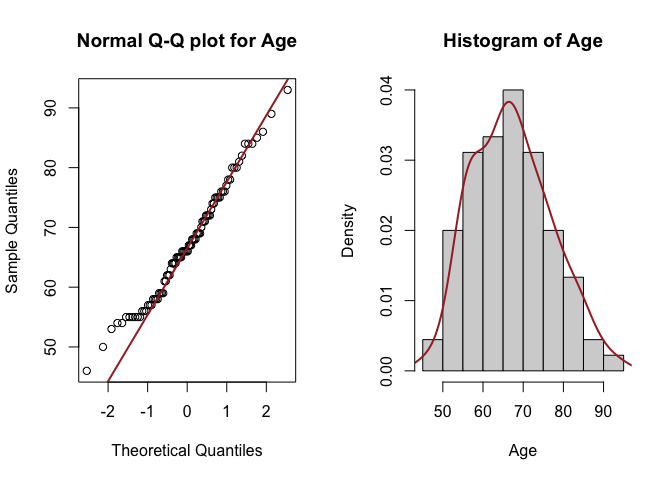
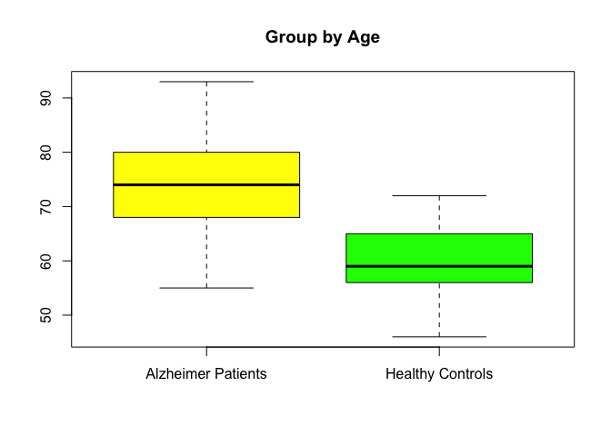
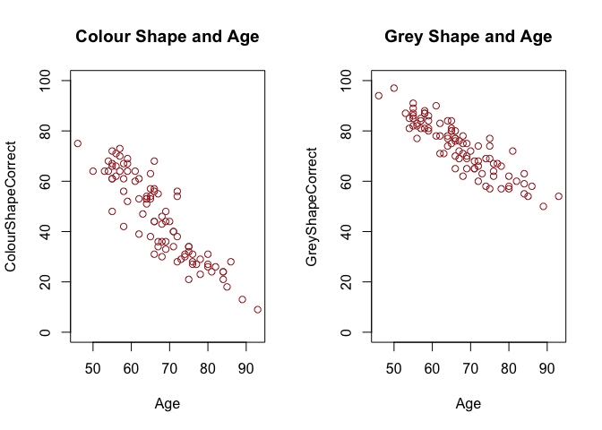
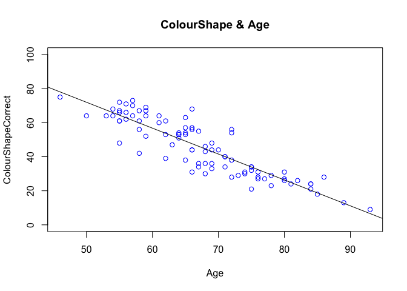
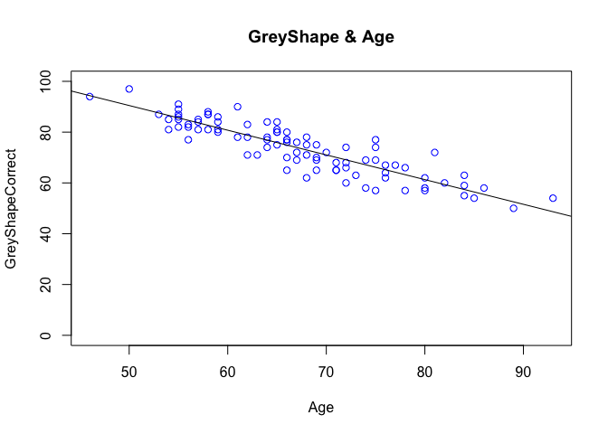
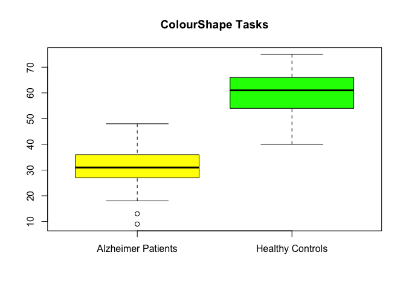
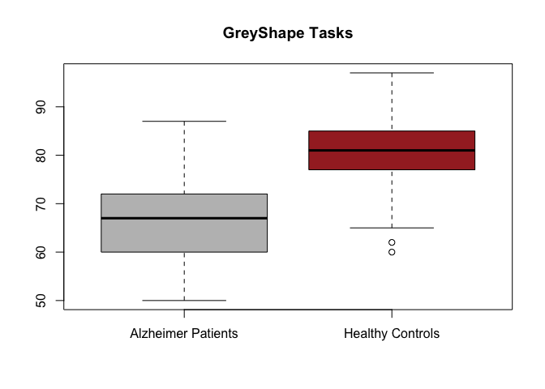

Cognitive tasks to analyse the ability of Alzheimer's patients in recalling differently coloured shapes or natural grey shapes using RStudio. 
================

### Introduction

The report is based on task designed to test the ability of participants
on some cognitive tasks. The cognitive task will test the recollection
of shapes that are either with different type of colours or just neutral
grey colour among these participants.

This test involved 90 participants, where 45 are diagnosed with
Alzheimer’s disease, and the other 45 have no cognitive impairment. Each
participant underwent 100 number of trials for the identification of
differently coloured shapes, and neutral grey shapes.

## Objectives of the Report

The report will achieve its objectives in two parts;

1.  Part one will give an understanding of the Dataset.

2.  In Part two, statistical hypotheses will be designed and assessed to
    answer some questions relating to whether or not people diagnosed
    with Alzheimer (Alzheimer’s patients) are worse at the cognitive
    tasks.

#### Calling needed library

``` r
library(psych) 
```

#### Setting the working directory, and importing the data

``` r
setwd('~/Desktop/Data World/Portfolio/Alzheimer')
Alzheimer_data <- read.csv("AlzheimersData.csv", head = TRUE)
attach(Alzheimer_data) 
```

### PART 1

#### (1a) Viewing the first 10 rows to visualize number of variables in the data-set

``` r
head(Alzheimer_data, 10)
```

    ##    Subject ColourShapeCorrect GreyShapeCorrect Gender Age AlzheimersDisease
    ## 1        1                 42               87 female  58              TRUE
    ## 2        2                 44               70 female  66              TRUE
    ## 3        3                 31               80 female  66              TRUE
    ## 4        4                 43               71   male  68              TRUE
    ## 5        5                 32               57 female  75              TRUE
    ## 6        6                 30               75 female  68              TRUE
    ## 7        7                  9               54   male  93              TRUE
    ## 8        8                 29               66 female  78              TRUE
    ## 9        9                 27               67   male  77              TRUE
    ## 10      10                 28               66   male  72              TRUE

The dataset consists of 6 variables which are; Subject: Number list of
participants in the task.

ColourShapeCorrect: List the number of differently coloured shapes
identified correctly.

GreyShapeCorrect: List the number of neutral grey colour shapes
identified correctly.

Gender: A list of the gender of the participants.

Age: List of ages of the participants.

AlzheimersDisease: Shows if a participant has Alzheimer (TRUE), or
Healthy (FALSE).

### (1b) Viewing the different datatype in the dataset

``` r
str(Alzheimer_data)
```

    ## 'data.frame':    90 obs. of  6 variables:
    ##  $ Subject           : int  1 2 3 4 5 6 7 8 9 10 ...
    ##  $ ColourShapeCorrect: int  42 44 31 43 32 30 9 29 27 28 ...
    ##  $ GreyShapeCorrect  : int  87 70 80 71 57 75 54 66 67 66 ...
    ##  $ Gender            : chr  "female" "female" "female" "male" ...
    ##  $ Age               : int  58 66 66 68 75 68 93 78 77 72 ...
    ##  $ AlzheimersDisease : logi  TRUE TRUE TRUE TRUE TRUE TRUE ...

### (1c) Summarizing the target variable to see if it is balanced

``` r
summary(AlzheimersDisease)
```

    ##    Mode   FALSE    TRUE 
    ## logical      45      45

A balanced dataset is a dataset that contains equal or almost equal
number of target variable. The target variable in this case is the
classification of the patients into TRUE/FALSE in AlzheimersDisease
variable.

Therefore, the dataset is balanced as the AlzheimersDisease variable has
the same 45 values for both outcome (TRUE/FALSE) of the target variable.

### (1d) Summary statistics of the six variables

``` r
describe(Subject)
```

    ##    vars  n mean    sd median trimmed   mad min max range skew kurtosis   se
    ## X1    1 90 45.5 26.12   45.5    45.5 33.36   1  90    89    0    -1.24 2.75

``` r
describe(ColourShapeCorrect)
```

    ##    vars  n  mean    sd median trimmed   mad min max range  skew kurtosis   se
    ## X1    1 90 45.73 16.62     45   45.92 22.24   9  75    66 -0.07    -1.21 1.75

``` r
describe(GreyShapeCorrect)
```

    ##    vars  n  mean    sd median trimmed   mad min max range  skew kurtosis   se
    ## X1    1 90 73.68 10.58     75    73.9 11.86  50  97    47 -0.16    -0.84 1.12

``` r
describe(Age)
```

    ##    vars  n  mean  sd median trimmed   mad min max range skew kurtosis   se
    ## X1    1 90 67.24 9.7     66   66.76 11.12  46  93    47 0.33    -0.46 1.02

``` r
table(Gender)
```

    ## Gender
    ## female   male 
    ##     48     42

``` r
prop.table(table(Gender))       
```

    ## Gender
    ##    female      male 
    ## 0.5333333 0.4666667

``` r
table(AlzheimersDisease)
```

    ## AlzheimersDisease
    ## FALSE  TRUE 
    ##    45    45

``` r
prop.table(table(AlzheimersDisease))
```

    ## AlzheimersDisease
    ## FALSE  TRUE 
    ##   0.5   0.5

1.  Subject: There are 90 observations which indicate the number of
    participants. It has the minimum 1, and the maximum 90, which is the
    first and last participant respectively.

2.  ColourShapeCorrect: The measure of central tendency shows a mean of
    45.73, and median of 45. The closeness of the mean and median shows
    the data is symmetric, and no outliers in the dataset. The measure
    of dispersion shows a standard deviation of 16.62 which means that
    most of the correct trials (68%) are 16.62 within the mean, that is
    29.11 – 62.35, at one standard deviation from the mean. The range of
    the data is 66. The skewness is -0.07 which is close to zero and
    shows the dataset as being approximately symmetric.

3.  GreyShapeCorrect: The mean is 73.68, and median is 75, the closeness
    in these values show there are no outliers in the variable. The
    standard deviation is 10.58, and this indicates 68% of the correct
    grey shape identification by the participants are within 63.1 -
    84.26 out of the 100 trials. The range is 47, and the data has a
    skewness of -0.16.

4.  Age: Variable age has a mean of 67.24, and a median of 66, which
    again shows there are no outliers in the dataset. The standard
    deviation is 9.7, meaning majority of the participants (68%) are
    between 57.54 - 76.94 years old. The range of age is 47, and the
    skewness is 0.33.

5.  Gender: There are 90 observations with 48 being female approximately
    (53%), and 42 being male (47%).

6.  AlzheimersDisease: There are 90 observations with 45 being with
    Alzheimer Disease (TRUE), and 45 being Healthy (FALSE).

### (1e) Range of ages in the Alzheimer’s disease patients and Healthy Controls

``` r
Alz_disease <- split(Alzheimer_data, f = AlzheimersDisease)  #splitting the dataset by variable AlzheimersDisease into those with Alzheimer, Alz_disease = TRUE, and Healthy, Alz_disease = FALSE
head(Alz_disease, 5)
```

    ## $`FALSE`
    ##    Subject ColourShapeCorrect GreyShapeCorrect Gender Age AlzheimersDisease
    ## 46      46                 64               78 female  61             FALSE
    ## 47      47                 54               68 female  72             FALSE
    ## 48      48                 68               65 female  66             FALSE
    ## 49      49                 64               97 female  50             FALSE
    ## 50      50                 44               69   male  69             FALSE
    ## 51      51                 52               81 female  59             FALSE
    ## 52      52                 61               78 female  62             FALSE
    ## 53      53                 70               85 female  57             FALSE
    ## 54      54                 71               82   male  56             FALSE
    ## 55      55                 53               83 female  62             FALSE
    ## 56      56                 67               84   male  59             FALSE
    ## 57      57                 57               84   male  65             FALSE
    ## 58      58                 61               85 female  55             FALSE
    ## 59      59                 75               94   male  46             FALSE
    ## 60      60                 53               80 female  65             FALSE
    ## 61      61                 68               85   male  54             FALSE
    ## 62      62                 66               83   male  56             FALSE
    ## 63      63                 48               70 female  69             FALSE
    ## 64      64                 54               80 female  65             FALSE
    ## 65      65                 64               87 female  53             FALSE
    ## 66      66                 55               76 female  67             FALSE
    ## 67      67                 40               65   male  71             FALSE
    ## 68      68                 57               77 female  66             FALSE
    ## 69      69                 69               80 female  59             FALSE
    ## 70      70                 67               88 female  58             FALSE
    ## 71      71                 61               86   male  55             FALSE
    ## 72      72                 64               84 female  57             FALSE
    ## 73      73                 67               89   male  55             FALSE
    ## 74      74                 60               90 female  61             FALSE
    ## 75      75                 54               84   male  64             FALSE
    ## 76      76                 51               78 female  64             FALSE
    ## 77      77                 53               77 female  64             FALSE
    ## 78      78                 56               77   male  66             FALSE
    ## 79      79                 66               87   male  55             FALSE
    ## 80      80                 53               74   male  64             FALSE
    ## 81      81                 63               75   male  65             FALSE
    ## 82      82                 61               81   male  58             FALSE
    ## 83      83                 46               62   male  68             FALSE
    ## 84      84                 56               87   male  58             FALSE
    ## 85      85                 62               77 female  56             FALSE
    ## 86      86                 64               81   male  54             FALSE
    ## 87      87                 72               91 female  55             FALSE
    ## 88      88                 64               86   male  59             FALSE
    ## 89      89                 73               81   male  57             FALSE
    ## 90      90                 56               60   male  72             FALSE
    ## 
    ## $`TRUE`
    ##    Subject ColourShapeCorrect GreyShapeCorrect Gender Age AlzheimersDisease
    ## 1        1                 42               87 female  58              TRUE
    ## 2        2                 44               70 female  66              TRUE
    ## 3        3                 31               80 female  66              TRUE
    ## 4        4                 43               71   male  68              TRUE
    ## 5        5                 32               57 female  75              TRUE
    ## 6        6                 30               75 female  68              TRUE
    ## 7        7                  9               54   male  93              TRUE
    ## 8        8                 29               66 female  78              TRUE
    ## 9        9                 27               67   male  77              TRUE
    ## 10      10                 28               66   male  72              TRUE
    ## 11      11                 30               58 female  74              TRUE
    ## 12      12                 33               75 female  69              TRUE
    ## 13      13                 27               62 female  76              TRUE
    ## 14      14                 31               69 female  74              TRUE
    ## 15      15                 13               50   male  89              TRUE
    ## 16      16                 47               71 female  63              TRUE
    ## 17      17                 21               69   male  75              TRUE
    ## 18      18                 18               54 female  85              TRUE
    ## 19      19                 34               69   male  67              TRUE
    ## 20      20                 21               63 female  84              TRUE
    ## 21      21                 29               63   male  73              TRUE
    ## 22      22                 38               74   male  72              TRUE
    ## 23      23                 34               65 female  71              TRUE
    ## 24      24                 39               71   male  62              TRUE
    ## 25      25                 24               59 female  84              TRUE
    ## 26      26                 24               72 female  81              TRUE
    ## 27      27                 44               72   male  70              TRUE
    ## 28      28                 26               60 female  82              TRUE
    ## 29      29                 24               55 female  84              TRUE
    ## 30      30                 31               67 female  76              TRUE
    ## 31      31                 28               64   male  76              TRUE
    ## 32      32                 26               57   male  80              TRUE
    ## 33      33                 36               72 female  67              TRUE
    ## 34      34                 23               57   male  78              TRUE
    ## 35      35                 44               76   male  66              TRUE
    ## 36      36                 31               58   male  80              TRUE
    ## 37      37                 27               62 female  80              TRUE
    ## 38      38                 48               82   male  55              TRUE
    ## 39      39                 28               58   male  86              TRUE
    ## 40      40                 38               81   male  65              TRUE
    ## 41      41                 36               78 female  68              TRUE
    ## 42      42                 34               77 female  75              TRUE
    ## 43      43                 34               74   male  75              TRUE
    ## 44      44                 40               68 female  71              TRUE
    ## 45      45                 36               65 female  69              TRUE

``` r
detach(Alzheimer_data)
```

##### Getting range for the Alzheimer’s Disease patients

``` r
Alzheimer_patients <- Alz_disease$'TRUE'
head(Alzheimer_patients, 5)
```

    ##   Subject ColourShapeCorrect GreyShapeCorrect Gender Age AlzheimersDisease
    ## 1       1                 42               87 female  58              TRUE
    ## 2       2                 44               70 female  66              TRUE
    ## 3       3                 31               80 female  66              TRUE
    ## 4       4                 43               71   male  68              TRUE
    ## 5       5                 32               57 female  75              TRUE

``` r
attach(Alzheimer_patients)

range_Alzheimer_patients <- max(Age) - min(Age)
range_Alzheimer_patients
```

    ## [1] 38

``` r
detach(Alzheimer_patients)
```

For Alzheimer’s Disease patients, the maximum age is 93 and the minimum
age is 55. The range for Alzheimer disease patients is 38.

#### Getting range for healthy controls

``` r
Healthy_controls <- Alz_disease$'FALSE'
head(Healthy_controls, 5)
```

    ##    Subject ColourShapeCorrect GreyShapeCorrect Gender Age AlzheimersDisease
    ## 46      46                 64               78 female  61             FALSE
    ## 47      47                 54               68 female  72             FALSE
    ## 48      48                 68               65 female  66             FALSE
    ## 49      49                 64               97 female  50             FALSE
    ## 50      50                 44               69   male  69             FALSE

``` r
attach(Healthy_controls)

range_Healthy_controls <- max(Age) - min(Age)
range_Healthy_controls
```

    ## [1] 26

``` r
detach(Healthy_controls)
```

For the healthy controls, the maximum age is 72 and the minimum age is
46. The healthy control group has a range of 26.

### (1f) Summary statistics for Alzheimer’s Disease and Healthy controls

#### Summary statistics for Alzheimer’s Disease

``` r
attach(Alzheimer_patients)

summary(Alzheimer_patients)
```

    ##     Subject   ColourShapeCorrect GreyShapeCorrect    Gender         
    ##  Min.   : 1   Min.   : 9.00      Min.   :50.00    Length:45         
    ##  1st Qu.:12   1st Qu.:27.00      1st Qu.:60.00    Class :character  
    ##  Median :23   Median :31.00      Median :67.00    Mode  :character  
    ##  Mean   :23   Mean   :31.38      Mean   :67.11                      
    ##  3rd Qu.:34   3rd Qu.:36.00      3rd Qu.:72.00                      
    ##  Max.   :45   Max.   :48.00      Max.   :87.00                      
    ##       Age        AlzheimersDisease
    ##  Min.   :55.00   Mode:logical     
    ##  1st Qu.:68.00   TRUE:45          
    ##  Median :74.00                    
    ##  Mean   :73.84                    
    ##  3rd Qu.:80.00                    
    ##  Max.   :93.00

``` r
detach(Alzheimer_patients)
```

#### Summary statistics for Healthy controls

``` r
attach(Healthy_controls)

summary(Healthy_controls)
```

    ##     Subject   ColourShapeCorrect GreyShapeCorrect    Gender         
    ##  Min.   :46   Min.   :40.00      Min.   :60.00    Length:45         
    ##  1st Qu.:57   1st Qu.:54.00      1st Qu.:77.00    Class :character  
    ##  Median :68   Median :61.00      Median :81.00    Mode  :character  
    ##  Mean   :68   Mean   :60.09      Mean   :80.24                      
    ##  3rd Qu.:79   3rd Qu.:66.00      3rd Qu.:85.00                      
    ##  Max.   :90   Max.   :75.00      Max.   :97.00                      
    ##       Age        AlzheimersDisease
    ##  Min.   :46.00   Mode :logical    
    ##  1st Qu.:56.00   FALSE:45         
    ##  Median :59.00                    
    ##  Mean   :60.64                    
    ##  3rd Qu.:65.00                    
    ##  Max.   :72.00

``` r
detach(Healthy_controls)
```

1.  ColourShapeCorrect: For the Alzheimer’s patients, it has a mean of
    31.38, and median 31. On average, Alzheimer’s disease patients are
    only able to identify approximately differently coloured shapes
    correctly 31 times out of the 100 trials. For the Healthy group, it
    has a mean of 60.09 and median of 61. On average, the healthy
    control group were able to identify differently coloured shapes
    correctly approximately 60 times out of the 100 trials. This shows
    that the Healthy control group are better at identifying differently
    coloured shapes.

2.  GreyShapeCorrect: For Alzheimer’s patients, the mean is 67.11 and
    median 67. The Alzheimer’s patients identified approximately 67 out
    of the 100 trials correctly for the Grey shaped. For healthy
    controls, the grey colour task has a mean of 80.24 and median of 81.
    For this task also, the healthy controls group still performed
    better than the Alzheimer’s group. The means of the two groups
    (Alzheimer’s disease and Healthy Controls), for ColourShapeCorrect
    and GreyShapeCorrect indicate that both groups did better in
    identifying Grey Shape than different coloured shapes.

3.  Age: The mean age of the Alzheimer disease patients is 73.84, and
    median is 74. The mean of the age for the healthy control group is
    60.64, and median is 59. This shows that older people are more at
    risk of having Alzheimer’s disease. The range indicates maximum age
    of 93, and minimum age of 55 for the Alzheimer’s group which gives a
    range of 38. Healthy control group has maximum of 72 and minimum of
    46, with range of 26. This further shows that older people are more
    prone to the disease. The two groups age skewness tend toward
    symmetric, and kurtosis being light tailed.

4.  Gender: Out of the 45 Alzheimer patients, 25 are female (56%), and
    20 are male (44%). Of the 45 healthy controls, 23 are female (51%),
    and 22 are male (49%). We have more female in both group, this is
    because there are more female participants in the tasks (48 female,
    to 42 male).

### PART 2

In this part, the designing and assessment of hypotheses on the data is
done using test(s) for differences. The hypotheses relate to whether
Alzheimer’s patients are worse at the cognitive tasks or not. In other
to reach a conclusion we considered the Age, Gender, correct
identification of the cognitive tasks (differently coloured shape and
neutral grey shape). The following analysis were done to reach a
conclusion;

1.  Are there differences in age or gender between the Alzheimer’s
    disease group and the healthy control group?

2.  Is there a correlation between gender and/or age and number of
    correct trials for either/both tasks? How would this effect your
    analysis?

3.  Can linear regression be used to discount the effect of gender
    and/or age if such correlations exist?

4.  What statistical test for differences should be used (and on which
    parts of the data) to address your hypothesis?

#### (2i) Test for Differences in Age or Gender Between the Alzheimer’s Disease and Healthy Control Group

##### Firstly, test for normality and visualization is done for Age

``` r
attach(Alzheimer_data)

par(mfrow=c(1,2))
qqnorm(Age, main = "Normal Q-Q plot for Age")
qqline(Age, lwd = 2, col = "brown")

hist(Age, freq = FALSE, xlab = "Age", ylab = "Density", main = "Histogram of Age")
lines(density(Age), col = "brown", lwd = 2)
```

<!-- -->

Figure 1: Q-Q plot, and Histogram show the dataset is normally
distributed

#### Carrying out a Kolmogorov-Smirnov test to ascertain the normality and know the test to use

``` r
shapiro.test(Age)
```

    ## 
    ##  Shapiro-Wilk normality test
    ## 
    ## data:  Age
    ## W = 0.98107, p-value = 0.2144

The Shapiro test is p = 0.2144, which is \> alpha = 0.05. We accept the
null hypothesis that implies that the distribution of the data is not
significantly different from normal distribution. Therefore, we can
assume the normality, and go for a Parametric test.

#### (2ia) Test for the difference in Age between the Alzheimer’s disease group, and the healthy control group.

The two-sided hypothesis is stated below: Ho: There is no statistical
significance difference between the average age of the two groups H1:
There is evidence that the average age of the two groups differ
significantly

``` r
Alzheimer_split_data <- split(Alzheimer_data, f = AlzheimersDisease)
Alzheimer_split_data
```

    ## $`FALSE`
    ##    Subject ColourShapeCorrect GreyShapeCorrect Gender Age AlzheimersDisease
    ## 46      46                 64               78 female  61             FALSE
    ## 47      47                 54               68 female  72             FALSE
    ## 48      48                 68               65 female  66             FALSE
    ## 49      49                 64               97 female  50             FALSE
    ## 50      50                 44               69   male  69             FALSE
    ## 51      51                 52               81 female  59             FALSE
    ## 52      52                 61               78 female  62             FALSE
    ## 53      53                 70               85 female  57             FALSE
    ## 54      54                 71               82   male  56             FALSE
    ## 55      55                 53               83 female  62             FALSE
    ## 56      56                 67               84   male  59             FALSE
    ## 57      57                 57               84   male  65             FALSE
    ## 58      58                 61               85 female  55             FALSE
    ## 59      59                 75               94   male  46             FALSE
    ## 60      60                 53               80 female  65             FALSE
    ## 61      61                 68               85   male  54             FALSE
    ## 62      62                 66               83   male  56             FALSE
    ## 63      63                 48               70 female  69             FALSE
    ## 64      64                 54               80 female  65             FALSE
    ## 65      65                 64               87 female  53             FALSE
    ## 66      66                 55               76 female  67             FALSE
    ## 67      67                 40               65   male  71             FALSE
    ## 68      68                 57               77 female  66             FALSE
    ## 69      69                 69               80 female  59             FALSE
    ## 70      70                 67               88 female  58             FALSE
    ## 71      71                 61               86   male  55             FALSE
    ## 72      72                 64               84 female  57             FALSE
    ## 73      73                 67               89   male  55             FALSE
    ## 74      74                 60               90 female  61             FALSE
    ## 75      75                 54               84   male  64             FALSE
    ## 76      76                 51               78 female  64             FALSE
    ## 77      77                 53               77 female  64             FALSE
    ## 78      78                 56               77   male  66             FALSE
    ## 79      79                 66               87   male  55             FALSE
    ## 80      80                 53               74   male  64             FALSE
    ## 81      81                 63               75   male  65             FALSE
    ## 82      82                 61               81   male  58             FALSE
    ## 83      83                 46               62   male  68             FALSE
    ## 84      84                 56               87   male  58             FALSE
    ## 85      85                 62               77 female  56             FALSE
    ## 86      86                 64               81   male  54             FALSE
    ## 87      87                 72               91 female  55             FALSE
    ## 88      88                 64               86   male  59             FALSE
    ## 89      89                 73               81   male  57             FALSE
    ## 90      90                 56               60   male  72             FALSE
    ## 
    ## $`TRUE`
    ##    Subject ColourShapeCorrect GreyShapeCorrect Gender Age AlzheimersDisease
    ## 1        1                 42               87 female  58              TRUE
    ## 2        2                 44               70 female  66              TRUE
    ## 3        3                 31               80 female  66              TRUE
    ## 4        4                 43               71   male  68              TRUE
    ## 5        5                 32               57 female  75              TRUE
    ## 6        6                 30               75 female  68              TRUE
    ## 7        7                  9               54   male  93              TRUE
    ## 8        8                 29               66 female  78              TRUE
    ## 9        9                 27               67   male  77              TRUE
    ## 10      10                 28               66   male  72              TRUE
    ## 11      11                 30               58 female  74              TRUE
    ## 12      12                 33               75 female  69              TRUE
    ## 13      13                 27               62 female  76              TRUE
    ## 14      14                 31               69 female  74              TRUE
    ## 15      15                 13               50   male  89              TRUE
    ## 16      16                 47               71 female  63              TRUE
    ## 17      17                 21               69   male  75              TRUE
    ## 18      18                 18               54 female  85              TRUE
    ## 19      19                 34               69   male  67              TRUE
    ## 20      20                 21               63 female  84              TRUE
    ## 21      21                 29               63   male  73              TRUE
    ## 22      22                 38               74   male  72              TRUE
    ## 23      23                 34               65 female  71              TRUE
    ## 24      24                 39               71   male  62              TRUE
    ## 25      25                 24               59 female  84              TRUE
    ## 26      26                 24               72 female  81              TRUE
    ## 27      27                 44               72   male  70              TRUE
    ## 28      28                 26               60 female  82              TRUE
    ## 29      29                 24               55 female  84              TRUE
    ## 30      30                 31               67 female  76              TRUE
    ## 31      31                 28               64   male  76              TRUE
    ## 32      32                 26               57   male  80              TRUE
    ## 33      33                 36               72 female  67              TRUE
    ## 34      34                 23               57   male  78              TRUE
    ## 35      35                 44               76   male  66              TRUE
    ## 36      36                 31               58   male  80              TRUE
    ## 37      37                 27               62 female  80              TRUE
    ## 38      38                 48               82   male  55              TRUE
    ## 39      39                 28               58   male  86              TRUE
    ## 40      40                 38               81   male  65              TRUE
    ## 41      41                 36               78 female  68              TRUE
    ## 42      42                 34               77 female  75              TRUE
    ## 43      43                 34               74   male  75              TRUE
    ## 44      44                 40               68 female  71              TRUE
    ## 45      45                 36               65 female  69              TRUE

``` r
Alzheimer_disease_group <- Alzheimer_split_data$'TRUE'
head(Alzheimer_disease_group, 5)
```

    ##   Subject ColourShapeCorrect GreyShapeCorrect Gender Age AlzheimersDisease
    ## 1       1                 42               87 female  58              TRUE
    ## 2       2                 44               70 female  66              TRUE
    ## 3       3                 31               80 female  66              TRUE
    ## 4       4                 43               71   male  68              TRUE
    ## 5       5                 32               57 female  75              TRUE

``` r
Healthy_control_group <- Alzheimer_split_data$'FALSE'
head(Healthy_control_group, 5)
```

    ##    Subject ColourShapeCorrect GreyShapeCorrect Gender Age AlzheimersDisease
    ## 46      46                 64               78 female  61             FALSE
    ## 47      47                 54               68 female  72             FALSE
    ## 48      48                 68               65 female  66             FALSE
    ## 49      49                 64               97 female  50             FALSE
    ## 50      50                 44               69   male  69             FALSE

``` r
test_Age <- t.test(Alzheimer_disease_group$Age, Healthy_control_group$Age, paired = FALSE)
test_Age
```

    ## 
    ##  Welch Two Sample t-test
    ## 
    ## data:  Alzheimer_disease_group$Age and Healthy_control_group$Age
    ## t = 8.7929, df = 81.1, p-value = 2.021e-13
    ## alternative hypothesis: true difference in means is not equal to 0
    ## 95 percent confidence interval:
    ##  10.21311 16.18689
    ## sample estimates:
    ## mean of x mean of y 
    ##  73.84444  60.64444

After using the t-test, at alpha = 0.05, that is 95% confidence
interval, the p-value = 2.021e-13. This is less than 0.05, and it is
statistically significant. Therefore, we reject the null hypothesis, and
conclude that there is evidence that the average age of the two groups
differ significantly.

##### Further test to determine which group is younger

``` r
t.test(Alzheimer_disease_group$Age, Healthy_control_group$Age, paired = FALSE, alternative = "less")
```

    ## 
    ##  Welch Two Sample t-test
    ## 
    ## data:  Alzheimer_disease_group$Age and Healthy_control_group$Age
    ## t = 8.7929, df = 81.1, p-value = 1
    ## alternative hypothesis: true difference in means is less than 0
    ## 95 percent confidence interval:
    ##      -Inf 15.69781
    ## sample estimates:
    ## mean of x mean of y 
    ##  73.84444  60.64444

At alpha = 0.05, the p-value = 1, we can reject the null hypothesis, and
conclude that the Healthy control group are younger. Figure 2, from this
we can visualize that the Alzheimer patients are older than the healthy
controls group.

##### Visualizing the Age by group

``` r
boxplot(Alzheimer_disease_group$Age, Healthy_control_group$Age, 
        main = "Group by Age", names = c("Alzheimer Patients", "Healthy Controls"), 
        col = c("yellow", "green"))
```

<!-- -->

Figure 2: Visualization of Age by the two groups

#### (2ib) The second test is to test for difference in Gender between the Alzheimer’s disease group and the healthy control group. The two-sided hypothesis is stated below:

Ho: There is no significant difference between the gender of the two
groups H1: There is difference between the gender of the two groups

Method: Two independent sample t-test can’t be used for gender as it is
a categorical data, instead a chi-square test of difference is used to
test the relationship between the categorical data – gender of the
Alzheimer’s disease group, and gender of the healthy control group.

``` r
test_Gender <- chisq.test(Alzheimer_disease_group$Gender, Healthy_control_group$Gender)
test_Gender
```

    ## 
    ##  Pearson's Chi-squared test with Yates' continuity correction
    ## 
    ## data:  Alzheimer_disease_group$Gender and Healthy_control_group$Gender
    ## X-squared = 0.027792, df = 1, p-value = 0.8676

The p-value = 0.8676, since p-value \> 0.05, we accept the null
hypothesis and conclude that there is no evidence of statistically
significant difference between the gender of the two groups (Alzheimer’s
and Healthy control).

#### (2ii) Checking for correlation between Age/Gender and the number of correct trials in the tasks

##### (2iia) Pearson Correlation between Gender and number of correct trials

Ho: There is no correlation between Gender and number of correct trials
for Colour Shape or Neutral Grey shape

H1: There is a correlation between Gender and number of correct trials
for Colour shape or Neutral Grey shape

``` r
Gender_category <- ifelse(Gender == "male", 1, 0)

cor.test(Gender_category, ColourShapeCorrect)
```

    ## 
    ##  Pearson's product-moment correlation
    ## 
    ## data:  Gender_category and ColourShapeCorrect
    ## t = 0.4075, df = 88, p-value = 0.6846
    ## alternative hypothesis: true correlation is not equal to 0
    ## 95 percent confidence interval:
    ##  -0.1651766  0.2482589
    ## sample estimates:
    ##        cor 
    ## 0.04339901

With a Pearson correlation of 0.043, and p-value = 0.684 at 95%
confidence interval, we can accept the null hypothesis, and conclude
that there is no statistically significant relationship between gender
and identification of the correct coloured shapes. That is, the gender
of the participants does not have a significant effect on the outcome of
the coloured shape task.

``` r
cor.test(Gender_category, GreyShapeCorrect)
```

    ## 
    ##  Pearson's product-moment correlation
    ## 
    ## data:  Gender_category and GreyShapeCorrect
    ## t = -0.10854, df = 88, p-value = 0.9138
    ## alternative hypothesis: true correlation is not equal to 0
    ## 95 percent confidence interval:
    ##  -0.2181377  0.1959915
    ## sample estimates:
    ##         cor 
    ## -0.01156917

Also, With low negative Pearson’s correlation of -0.011, and p-value =
0.914 at 95 confidence intervals, we accept null hypothesis, and
conclude that there is no statistically significant relationship between
Gender and number of correct trials for Grey Shapes. Which means, the
gender of the participants does not have a significant effect on the
outcome of the grey shape task.

##### (2iib) Correlation Between Age and Number of Correct Trials for the two tasks:

Ho: There is no correlation between Age and number of correct trials for
Colour Shape Correct or Neutral Grey shape

H1: There is a correlation between Age and number of correct Colour
shape trials r Neutral Grey shape

``` r
cor.test(Age, ColourShapeCorrect)
```

    ## 
    ##  Pearson's product-moment correlation
    ## 
    ## data:  Age and ColourShapeCorrect
    ## t = -18.167, df = 88, p-value < 2.2e-16
    ## alternative hypothesis: true correlation is not equal to 0
    ## 95 percent confidence interval:
    ##  -0.9253544 -0.8351117
    ## sample estimates:
    ##        cor 
    ## -0.8885357

At a strong negative Pearson correlation of -0.889, and a significant
p-value \< 2.2e-16, with 95% confidence interval, we reject the null
hypothesis. We conclude that there is a statistically significant
correlation between Age and number of correct trials for the colour
shape trials. That means, the age of the participants has an effect on
their ability to correctly identify the coloured shape tasks.

``` r
cor.test(Age, GreyShapeCorrect)
```

    ## 
    ##  Pearson's product-moment correlation
    ## 
    ## data:  Age and GreyShapeCorrect
    ## t = -18.604, df = 88, p-value < 2.2e-16
    ## alternative hypothesis: true correlation is not equal to 0
    ## 95 percent confidence interval:
    ##  -0.9283354 -0.8413997
    ## sample estimates:
    ##        cor 
    ## -0.8929053

Also, the Correlation coefficient of -0.892, and p-value \< 2.2e-16 at
95% confidence interval. We can reject the null hypothesis, and conclude
that there is a statistically significant correlation between Age and
number of correct trials for the Grey Shape trials. That is, there is a
relationship between how old the participants are, and their abilities
to correctly identify the grey shapes.

##### Visualizaing these relationships between particpants’ Age and ability to recognize either Colour shape or Nutral Grey shape correctly

``` r
par(mfrow=c(1,2))
plot(Age, ColourShapeCorrect, main = "Colour Shape and Age", col = "brown", ylim = c(0, 100)) 
plot(Age, GreyShapeCorrect, main = "Grey Shape and Age", col = "brown", ylim = c(0, 100))
```

<!-- -->

Figure 3: We can conclude from this that as age increases, the ability
to recognize either the Colour shape or Grey shape correctly reduces
(negative correlation).

#### (2iii) Using linear regression to discount the effect of Age

##### Effect of Age on ColourShapeCorrect

``` r
plot(Age, ColourShapeCorrect, main = "ColourShape & Age", col = "blue", ylim = c(0,100))
abline(lm(ColourShapeCorrect ~ Age))
```

<!-- -->

``` r
reg_ColourShape <- lm(ColourShapeCorrect ~ Age) 
summary(reg_ColourShape)
```

    ## 
    ## Call:
    ## lm(formula = ColourShapeCorrect ~ Age)
    ## 
    ## Residuals:
    ##      Min       1Q   Median       3Q      Max 
    ## -17.7976  -4.2825   0.0658   4.4675  20.3734 
    ## 
    ## Coefficients:
    ##              Estimate Std. Error t value Pr(>|t|)    
    ## (Intercept) 148.03752    5.68899   26.02   <2e-16 ***
    ## Age          -1.52138    0.08374  -18.17   <2e-16 ***
    ## ---
    ## Signif. codes:  0 '***' 0.001 '**' 0.01 '*' 0.05 '.' 0.1 ' ' 1
    ## 
    ## Residual standard error: 7.667 on 88 degrees of freedom
    ## Multiple R-squared:  0.7895, Adjusted R-squared:  0.7871 
    ## F-statistic:   330 on 1 and 88 DF,  p-value: < 2.2e-16

The slope is -1.52, meaning when age increases by 1, the ability to
identify the correct colour shape reduces by -1.52.

###### Effect of Age on GreyShapeCorrect

``` r
plot(Age, GreyShapeCorrect, main = "GreyShape & Age", col = "blue", ylim = c(0,100))
abline(lm(GreyShapeCorrect ~ Age))
```

<!-- -->

``` r
reg_GreyShape <- lm(GreyShapeCorrect ~ Age)
summary(reg_GreyShape) 
```

    ## 
    ## Call:
    ## lm(formula = GreyShapeCorrect ~ Age)
    ## 
    ## Residuals:
    ##      Min       1Q   Median       3Q      Max 
    ## -10.9421  -2.7907  -0.0998   2.9921  11.7156 
    ## 
    ## Coefficients:
    ##              Estimate Std. Error t value Pr(>|t|)    
    ## (Intercept) 139.15170    3.55547   39.14   <2e-16 ***
    ## Age          -0.97367    0.05234  -18.60   <2e-16 ***
    ## ---
    ## Signif. codes:  0 '***' 0.001 '**' 0.01 '*' 0.05 '.' 0.1 ' ' 1
    ## 
    ## Residual standard error: 4.792 on 88 degrees of freedom
    ## Multiple R-squared:  0.7973, Adjusted R-squared:  0.795 
    ## F-statistic: 346.1 on 1 and 88 DF,  p-value: < 2.2e-16

Slope at -0.97 means identification of Grey Shape correctly reduces by
-0.97 as the age increases by 1.

#### (2iv) Testing for difference in the cognitive tasks (Coloured & Grey) for the two groups

``` r
head(Alzheimer_disease_group, 5)
```

    ##   Subject ColourShapeCorrect GreyShapeCorrect Gender Age AlzheimersDisease
    ## 1       1                 42               87 female  58              TRUE
    ## 2       2                 44               70 female  66              TRUE
    ## 3       3                 31               80 female  66              TRUE
    ## 4       4                 43               71   male  68              TRUE
    ## 5       5                 32               57 female  75              TRUE

``` r
head(Healthy_control_group, 5)
```

    ##    Subject ColourShapeCorrect GreyShapeCorrect Gender Age AlzheimersDisease
    ## 46      46                 64               78 female  61             FALSE
    ## 47      47                 54               68 female  72             FALSE
    ## 48      48                 68               65 female  66             FALSE
    ## 49      49                 64               97 female  50             FALSE
    ## 50      50                 44               69   male  69             FALSE

###### Testing for difference in the ColouredShape tasks for the two groups

``` r
t.test(Alzheimer_disease_group$ColourShapeCorrect, 
       Healthy_control_group$ColourShapeCorrect, paired = FALSE)
```

    ## 
    ##  Welch Two Sample t-test
    ## 
    ## data:  Alzheimer_disease_group$ColourShapeCorrect and Healthy_control_group$ColourShapeCorrect
    ## t = -16.455, df = 87.693, p-value < 2.2e-16
    ## alternative hypothesis: true difference in means is not equal to 0
    ## 95 percent confidence interval:
    ##  -32.17883 -25.24339
    ## sample estimates:
    ## mean of x mean of y 
    ##  31.37778  60.08889

At alpha = 0.05, the p-value for the independent t-test for difference
in ColourShapeCorrect of the Alzheimer’s disease group and the Healthy
control group is p-value \< 2.2e-16, therefore we reject the null
hypothesis. We conclude that there is evidence that on average, there is
statistically significance difference between the performance of the
Alzheimer patients, and the healthy control in the Colour Shape
identification.

###### Further test to determine which group performed better in the Colour Shape tasks

We test further to find out which group performed better, using a
one-sided test, we have the hypothesis given; Ho: Alzheimer patients’
performance is greater than or equal to the healthy controls in the
ColouredShape tasks H1: Alzheimer patients’ performance is less than the
healthy controls in the cognitive tasks

``` r
t.test(Alzheimer_disease_group$ColourShapeCorrect, 
       Healthy_control_group$ColourShapeCorrect, paired = FALSE, alternative = "less")
```

    ## 
    ##  Welch Two Sample t-test
    ## 
    ## data:  Alzheimer_disease_group$ColourShapeCorrect and Healthy_control_group$ColourShapeCorrect
    ## t = -16.455, df = 87.693, p-value < 2.2e-16
    ## alternative hypothesis: true difference in means is less than 0
    ## 95 percent confidence interval:
    ##       -Inf -25.81042
    ## sample estimates:
    ## mean of x mean of y 
    ##  31.37778  60.08889

With a p-value \< 2.2e-16 at alpha = 0.05, we therefore reject the null
hypothesis, and conclude that the Healthy controls group performed
better in the Coloured Shape tasks. Figure 5 shows that the Healthy
controls group have more correct trials (higher median) in the Colour
Shape Tasks.

###### Visualizing the performance in the ColourShape tasks

``` r
boxplot(Alzheimer_disease_group$ColourShapeCorrect, Healthy_control_group$ColourShapeCorrect, 
        main = "ColourShape Tasks", names = c("Alzheimer Patients", "Healthy Controls"), 
        col = c("yellow", "green"))
```

<!-- -->

Figure 5: Performance of the two groups in identifying Coloured Shape
Tasks

###### Testing for difference in Neutal GreyShape tasks for the two groups

``` r
t.test(Alzheimer_disease_group$GreyShapeCorrect, 
       Healthy_control_group$GreyShapeCorrect, paired = FALSE)
```

    ## 
    ##  Welch Two Sample t-test
    ## 
    ## data:  Alzheimer_disease_group$GreyShapeCorrect and Healthy_control_group$GreyShapeCorrect
    ## t = -7.4906, df = 87.795, p-value = 5.079e-11
    ## alternative hypothesis: true difference in means is not equal to 0
    ## 95 percent confidence interval:
    ##  -16.617795  -9.648872
    ## sample estimates:
    ## mean of x mean of y 
    ##  67.11111  80.24444

At alpha = 0.05, the p-value for the difference in the GreyShapeCorrect
for the two groups is p-value = 5.079e-11, the null hypothesis is
rejected. It can be concluded that there is significant difference
between performance of the Alzheimer patients and the healthy controls
in the Grey Shape tasks.

####### Further test to determine which group performed better in the Grey Shape tasks

We can test further to determine which group performed better in the
Grey Shape tasks using a one-sided. The hypothesis given as:

Ho: Alzheimer patients’ performance is greater than or equal to the
healthy controls in the cognitive tasks. H1: Alzheimer patients’
performance is less than the healthy controls in the cognitive tasks

``` r
t.test(Alzheimer_disease_group$GreyShapeCorrect, 
       Healthy_control_group$GreyShapeCorrect, paired = FALSE, alternative = "less")
```

    ## 
    ##  Welch Two Sample t-test
    ## 
    ## data:  Alzheimer_disease_group$GreyShapeCorrect and Healthy_control_group$GreyShapeCorrect
    ## t = -7.4906, df = 87.795, p-value = 2.539e-11
    ## alternative hypothesis: true difference in means is less than 0
    ## 95 percent confidence interval:
    ##       -Inf -10.21863
    ## sample estimates:
    ## mean of x mean of y 
    ##  67.11111  80.24444

####### Visualizing the performance in Neutral GreyShape tasks

``` r
boxplot(Alzheimer_disease_group$GreyShapeCorrect, Healthy_control_group$GreyShapeCorrect, 
        main = "GreyShape Tasks", names = c("Alzheimer Patients", "Healthy Controls"), 
        col = c("grey", "brown"))
```

<!-- -->

Figure 6: Performance of the two groups in identifying Neutal Grey Shape
Tasks

``` r
detach(Alzheimer_data)
```

## Summary Findings and Discussion:

From the report, we investigated whether or not Alzheimer’s patients are
worse at cognitive tasks (identifying differently coloured shapes and
neutral grey shapes). This report considered 90 participants, 45 with
Alzheimer, and 45 healthy. In the analysis, we considered whether there
is difference in the Age or Gender of the two groups. It was found out
that;

1.  there is significant difference in average age of the two groups.
    That is, the older you are, the more likely you are to have
    Alzheimer. Gender, on the other hand, does not play a statistically
    significant role in the difference between the two groups.

2.  Furthermore, it was discovered that there is a relationship between
    Age and the number of correct trials in both tasks among the
    participants. Younger participants tend to perform better in the
    cognitive tasks. However, the gender of the participants has no
    significant correlation with their performance in the tasks.

3.  Linear regression was plotted to predict the outcome of the tasks
    with age being the independent variable due to the relationship it
    has in the outcome of the tasks. Test of differences were also done
    to determine which group performed better at the cognitive tasks,
    and it was discovered that the Healthy patients performed better at
    both tasks.

4.  It is also important to note that, both groups (Alzheimer’s disease
    patients and Healthy Controls), performed better in the Grey Shape
    tasks than in the coloured Shape tasks. That is, Alzheimer’s disease
    patients are better at recalling neutral grey shapes than
    differently coloured shapes.

## Conclusion:

From the findings, we can deduce that age plays a significant role in
whether participants have Alzheimer or not, as the average age of the
Alzheimer’s disease group is higher than that of the Healthy Control
groups. However, gender does not significantly indicate which group the
participants belong. Also, age have significant relationship with the
outcome of both cognitive tasks (identifying differently coloured shapes
and neutral grey shapes correctly), whereas the gender (either male or
female), does not significantly determine the outcome of the tasks for
any of the group. Additionally, the age of the participant is a good
predictor of the outcome of the cognitive task as it can be seen from
the linear regression equation.

Lastly, the healthy control group performed better in both cognitive
tasks (identification of differently coloured shapes and neutral grey
shapes) than the Alzheimer’s disease group. We can conclude that
Alzheimer’s disease significantly affects the ability of participants to
correctly identify both differently coloured shapes, and neutral grey
shapes.
